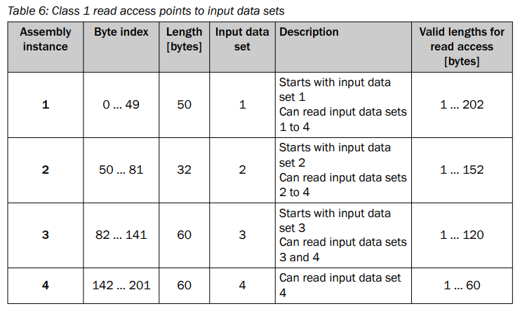
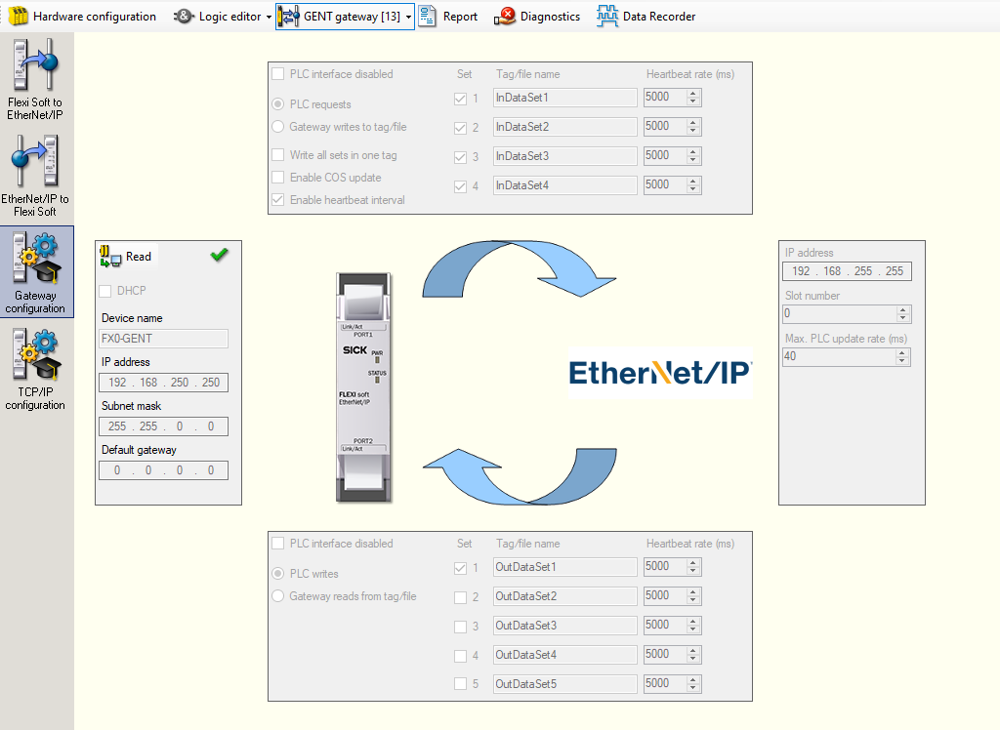
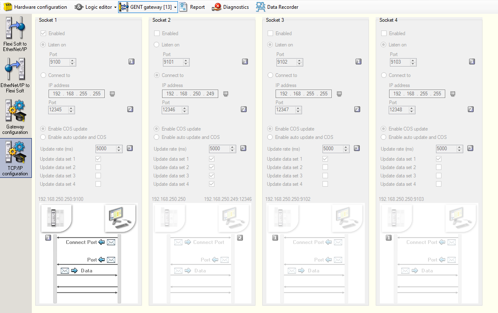

# Sick FlexySoft Ethernet IP

ROS 2 packages for Sick EthernetIP Gateway FX0-GENT00000

## How it works
```bash
ros2 service call /readInput ibt_ros2_interfaces/srv/GetAttrAll "clas: 0x72
instance: 1"
```
```bash
ros2 service call /setOutput ibt_ros2_interfaces/srv/SetAttrAll "clas: 0x72
instance: 1  
data:
- 255
- 0
- 0
- 0
- 0
- 0
- 0
- 0
- 0
- 0"
```

## Registers



## Common Errors
```python
# The following are CIP (Ethernet/IP) Generic error codes
CIP_ROUTER_ERROR_SUCCESS                   = 0x00  # We done good...
CIP_ROUTER_ERROR_FAILURE                   = 0x01  # Connection failure
CIP_ROUTER_ERROR_NO_RESOURCE               = 0x02  # Resource(s) unavailable
CIP_ROUTER_ERROR_INVALID_PARAMETER_VALUE   = 0x03  # Obj specific data bad
CIP_ROUTER_ERROR_INVALID_SEG_TYPE          = 0x04  # Invalid segment type in path
CIP_ROUTER_ERROR_INVALID_DESTINATION       = 0x05  # Invalid segment value in path
CIP_ROUTER_ERROR_PARTIAL_DATA              = 0x06  # Not all expected data sent
CIP_ROUTER_ERROR_CONN_LOST                 = 0x07  # Messaging connection lost
CIP_ROUTER_ERROR_BAD_SERVICE               = 0x08  # Unimplemented service code
CIP_ROUTER_ERROR_BAD_ATTR_DATA             = 0x09  # Bad attribute data value
CIP_ROUTER_ERROR_ATTR_LIST_ERROR           = 0x0A  # Get/set attr list failed
CIP_ROUTER_ERROR_ALREADY_IN_REQUESTED_MODE = 0x0B  # Obj already in requested mode
CIP_ROUTER_ERROR_OBJECT_STATE_CONFLICT     = 0x0C  # Obj not in proper mode
CIP_ROUTER_ERROR_OBJ_ALREADY_EXISTS        = 0x0D  # Object already created
CIP_ROUTER_ERROR_ATTR_NOT_SETTABLE         = 0x0E  # Set of get only attr tried
CIP_ROUTER_ERROR_PERMISSION_DENIED         = 0x0F  # Insufficient access permission
CIP_ROUTER_ERROR_DEV_IN_WRONG_STATE        = 0x10  # Device not in proper mode
CIP_ROUTER_ERROR_REPLY_DATA_TOO_LARGE      = 0x11  # Response packet too large
CIP_ROUTER_ERROR_FRAGMENT_PRIMITIVE        = 0x12  # Primitive value will fragment
CIP_ROUTER_ERROR_NOT_ENOUGH_DATA           = 0x13  # Goldilocks complaint #1
CIP_ROUTER_ERROR_ATTR_NOT_SUPPORTED        = 0x14  # Attribute is undefined
CIP_ROUTER_ERROR_TOO_MUCH_DATA             = 0x15  # Goldilocks complaint #2
CIP_ROUTER_ERROR_OBJ_DOES_NOT_EXIST        = 0x16  # Non-existant object specified
CIP_ROUTER_ERROR_NO_FRAGMENTATION          = 0x17  # Fragmentation not active
CIP_ROUTER_ERROR_DATA_NOT_SAVED            = 0x18  # Attr data not previously saved
CIP_ROUTER_ERROR_DATA_WRITE_FAILURE        = 0x19  # Attr data not saved this time
CIP_ROUTER_ERROR_REQUEST_TOO_LARGE         = 0x1A  # Routing failure on request
CIP_ROUTER_ERROR_RESPONSE_TOO_LARGE        = 0x1B  # Routing failure on response
CIP_ROUTER_ERROR_MISSING_LIST_DATA         = 0x1C  # Attr data not found in list
CIP_ROUTER_ERROR_INVALID_LIST_STATUS       = 0x1D  # Returned list of attr w/status
CIP_ROUTER_ERROR_SERVICE_ERROR             = 0x1E  # Embedded service failed
CIP_ROUTER_ERROR_VENDOR_SPECIFIC           = 0x1F  # Vendor specific error
CIP_ROUTER_ERROR_INVALID_PARAMETER         = 0x20  # Invalid parameter
CIP_ROUTER_ERROR_WRITE_ONCE_FAILURE        = 0x21  # Write once previously done
CIP_ROUTER_ERROR_INVALID_REPLY             = 0x22  # Invalid reply received
CIP_ROUTER_ERROR_BAD_KEY_IN_PATH           = 0x25  # Electronic key in path failed
CIP_ROUTER_ERROR_BAD_PATH_SIZE             = 0x26  # Invalid path size
CIP_ROUTER_ERROR_UNEXPECTED_ATTR           = 0x27  # Cannot set attr at this time
CIP_ROUTER_ERROR_INVALID_MEMBER            = 0x28  # Member ID in list nonexistant
CIP_ROUTER_ERROR_MEMBER_NOT_SETTABLE       = 0x29  # Cannot set value of member
CIP_ROUTER_ERROR_UNKNOWN_MODBUS_ERROR      = 0x2B  # Unhandled Modbus Error
CIP_ROUTER_ERROR_STILL_PROCESSING          = 0xFF  # Special marker to indicate we haven't finished processing the request yet
```

## FlexySoftDesigner Settings
### Gateway Configuration


### TCP/IP Configuration
